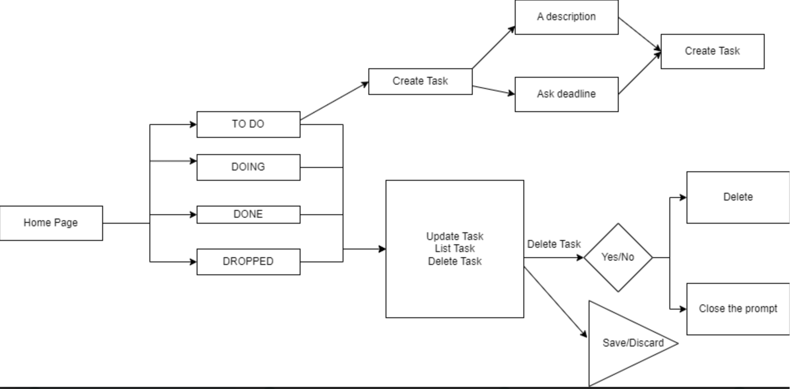

# CPSC362-Group-8: Task Management System (Kanban Board)
## Group Members:
### Poleth Acosta, Jason Chieu, Brandy Nguyen, Vinh Nguyen
# Requirements
- Working front-end
- Functional backend 
- Add, update, and delete buttons should work
## Overview:
This project is a kanban board task managment system where users can add a task in a certain category: to do, doing, done, or dropped. In addition, users can update their task and delete certain tasks in any category by simply making sure to select the correct category when doing these updates.

## Video demo link: 

## How to run 
- Install node
- Install visual studio code
- Install Docker
1. Run the frontend
    - Open terminal in the project folder
    - cd terminal
    - cd src
    - npm install react-modal
    - npm start (should run on localhost:3000)
2. Run the backend
    - Open terminal in the project folder
    - cd terminal
    - cd backend
    - pip install Flask
    - pip install Flask-PyMongo
    - pip install -U flask-cors
    - python api.py
3. Run the database
    - Have docker desktop started and minimised. Run docker-compose up in the terminal

## Software Requirement Specifications
- Home screen and then three columns - to do, doing, done, dropped

1.1 to do
- Needs to have create task
- Working update task option
- Be able to delete task

1.2 doing
- Needs to have create task
- Working update task option
- Be able to delete task

1.3 done
- Needs to have create task
- Working update task option
- Be able to delete task

1.4 dropped
- Needs to have create task
- Working update task option
- Be able to delete task

## Scrum update 16th February
-Who is doing what?

Brandy Nguyen, Poleth Acosta, Vinh Nguyen, Jason Chiu: readME.md, create github repo, create business flowchart

-What did you discuss in today's meeting?

Brandy Nguyen, Poleth Acosta, Vinh Nguyen, Jason Chiu: Went over project, made discord, figure out what everyone is doing

-What's for next?

Brandy Nguyen, Poleth Acosta, Vinh Nguyen, Jason Chiu: Start the frontend 

## Scrum update 15th March
-Tasks Done:

Brandy Nguyen, Poleth Acosta, Vinh Nguyen, Jason Chiu: update readME.md, started front and backend 

-To Do:

Finish backend and have both front and backend functional

